🚀 JOBMATCH: EDU2JOB
An AI-powered career prediction system that analyzes a user’s academic background and recommends the most suitable job roles using machine learning.

📌 Introduction
JOBMATCH: EDU2JOB is a smart career guidance platform designed to bridge the gap between education and employment.
It uses machine learning techniques to analyze user academic data and predict suitable career paths.
The system provides an interactive dashboard, profile management, prediction history, and an admin panel for analytics.

❗ Problem Statement
Students often struggle to identify the right career path based on their academic background.
Traditional guidance systems are:
❌ Generic and not personalized
❌ Not data-driven
❌ Lack real-time insights
👉 This project solves the problem by providing data-driven career recommendations.

🎯 Objectives
To predict suitable job roles based on education details
To provide a user-friendly dashboard
To store and analyze user data
To implement admin control and analytics
To ensure data consistency using structured inputs

🧩 Features
👤 User Features
User Registration & Login (with validation)
Profile Management (view & edit mode)
Dynamic dropdown (Field → Skills mapping)
Career Prediction with confidence score
Prediction History tracking
Resume upload module (UI)

🧠 ML Features
Rule-based + ML-based prediction system
Dataset-driven recommendations
Top 3 job suggestions with probability

📊 Dashboard Features
Interactive UI (Streamlit)
Job distribution visualization (Plotly)
Real-time prediction output

🔐 Admin Panel (Advanced)
User Management (view/delete users)
Prediction Analytics
Data insights & reports
Clean and modern UI

🛠 Technology Stack
💻 Frontend
Streamlit (UI Framework)
HTML + CSS (Custom Styling)

⚙ Backend
Python

🧠 Machine Learning
Scikit-learn
Pandas
NumPy
Joblib

🗄 Database
SQLite

📊 Visualization
Plotly
Matplotlib
Seaborn

🧪 Project Workflow

User Login/Register
        ↓
Enter Profile Details
        ↓
Select Education Inputs
        ↓
Model Prediction
        ↓
Display Results + Confidence
        ↓
Save History
        ↓
Admin Analytics

🧱 Milestones
🔹 Milestone 1: User Authentication & Profile
Secure login/register system
Profile creation & dashboard
🔹 Milestone 2: Education Input Processing
Input validation (Degree, Specialization, CGPA)
Data storage in database
🔹 Milestone 3: Job Role Prediction
ML model integration
Top 3 predictions with confidence
History saving
🔹 Milestone 4: Visualization & Admin Panel
Analytics dashboard
User management system

Reports & insights
📂 Project Structure

JOB_MATCH/
│
├── streamlit_app.py
├── database.py
├── model_training.py
├── model_pipeline.pkl
├── job_dataset.csv
├── requirements.txt
└── README.md

⚡ How to Run
Bash
# Clone repository
git clone https://github.com/your-username/jobmatch.git

# Navigate folder
cd jobmatch

# Install dependencies
pip install -r requirements.txt

# Run app
streamlit run streamlit_app.py

💡 Key Highlights
✅ Dataset-driven dropdown system
✅ Dynamic skill selection
✅ Clean UI with modern design
✅ Admin analytics panel
✅ End-to-end ML integration

🔮 Future Scope
AI-based resume analysis
Job portal integration
Recommendation system with deep learning
Mobile app version
Real-time job market insights

📸 Screenshots
🏠 Landing Page
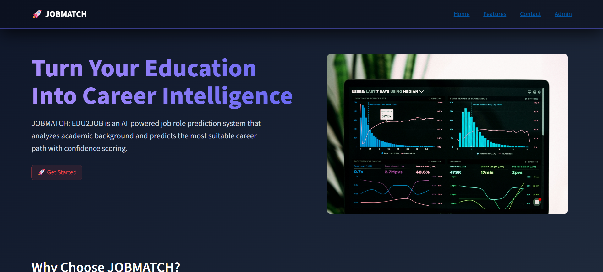
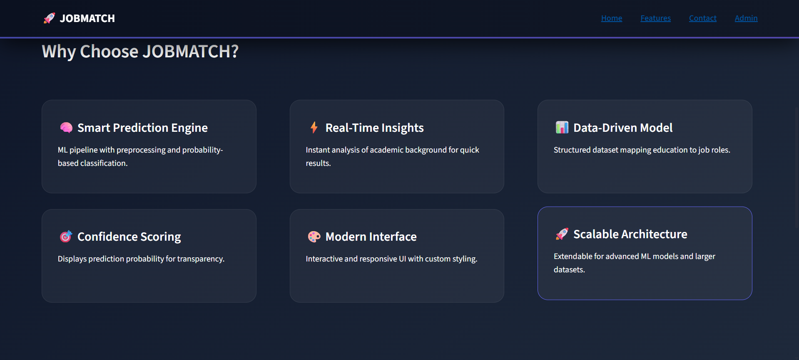
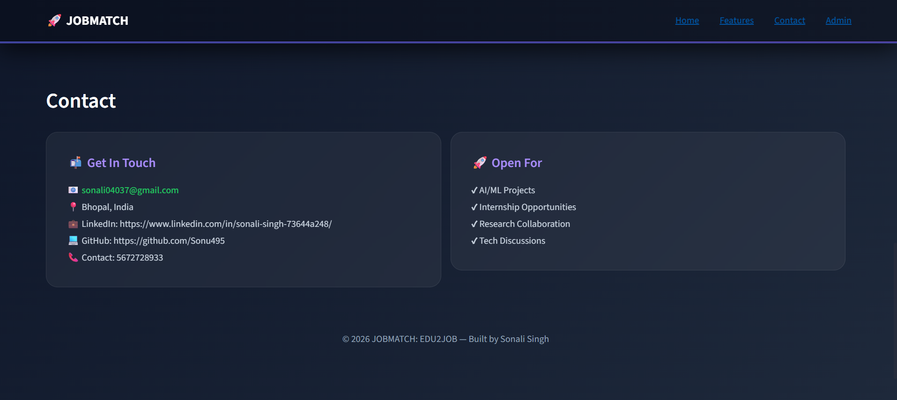
🔐 Login / Register Page
LOGIN PAGE
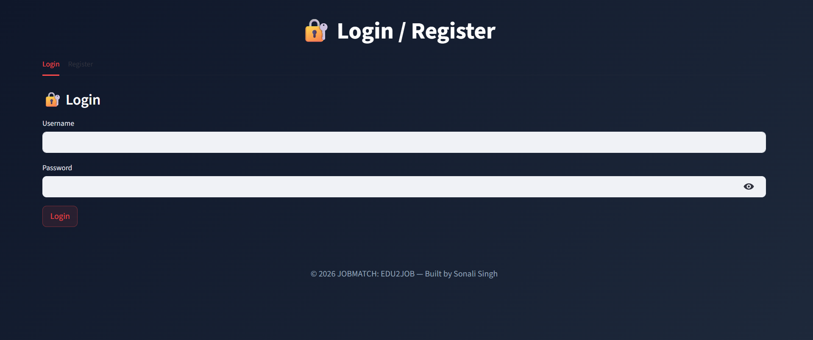
REGISTER PAGE
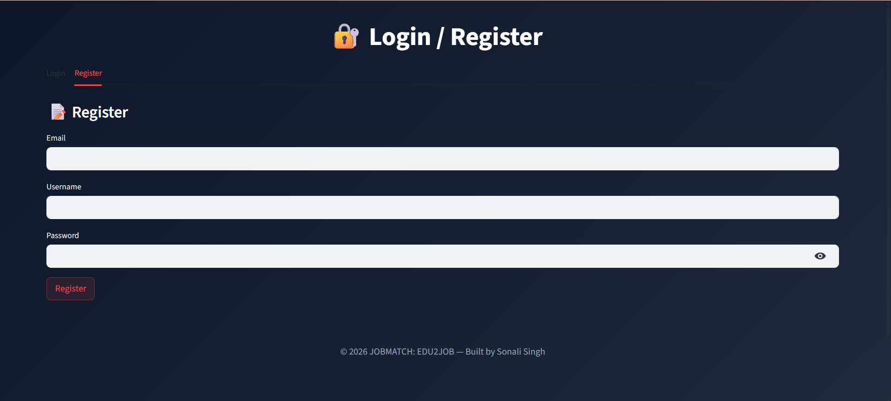
👤 User Dashboard
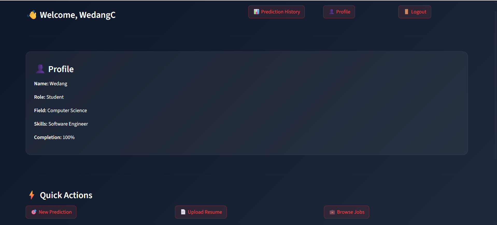
✏ Edit Profile 
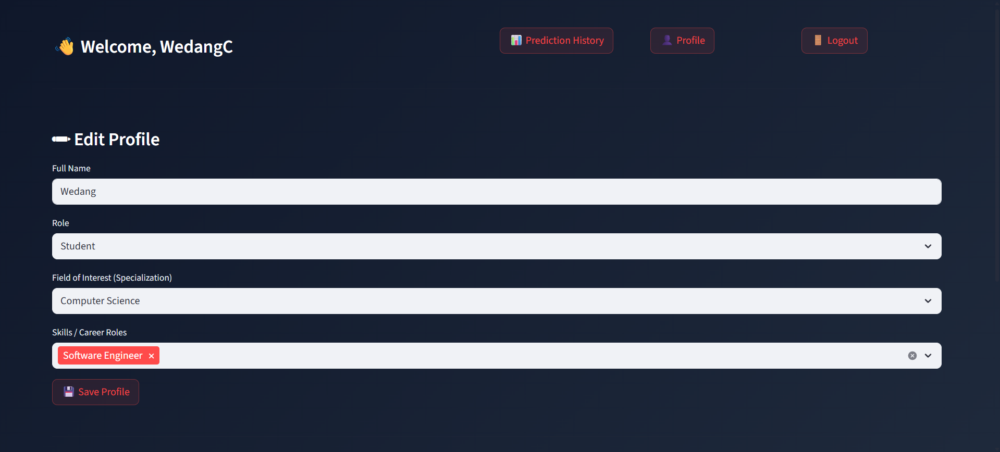
🎯 Prediction Dashboard
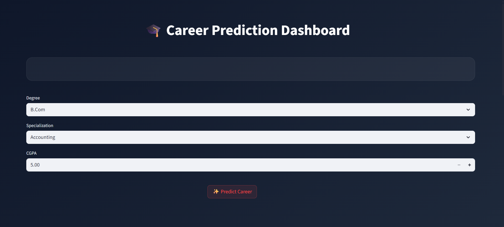
🎯 Prediction Result

📊 Analytics / Visualization
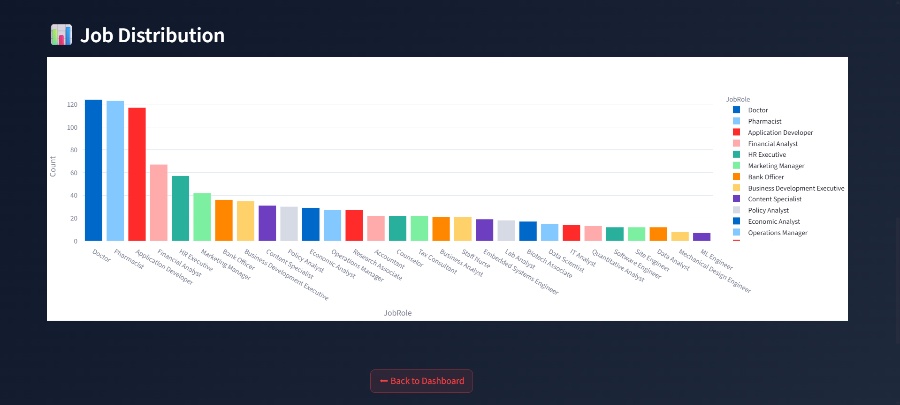
⏱️Prediction History
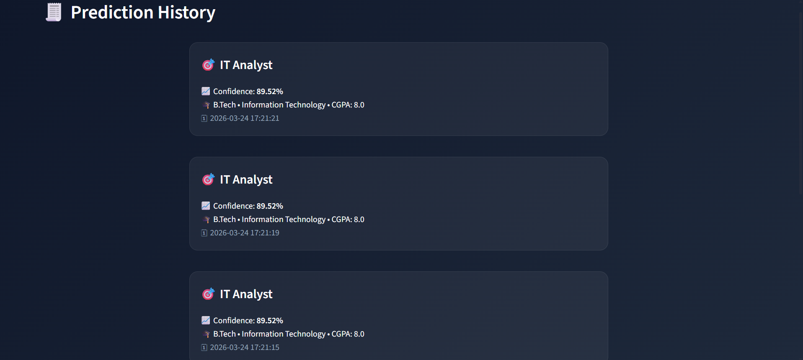
⬆️ Upload Resume
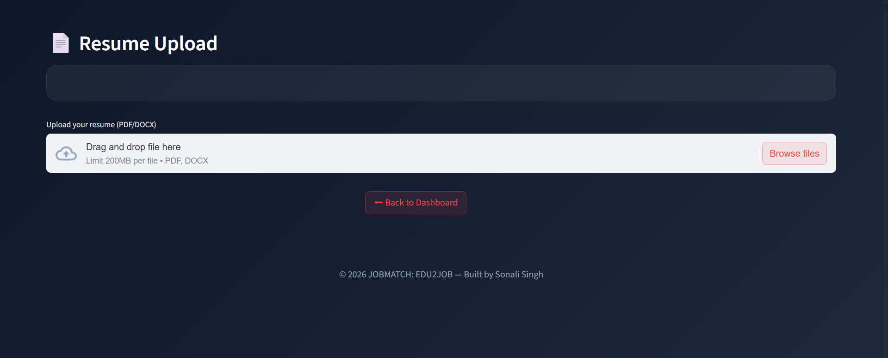
🛠🔐 Admin Login
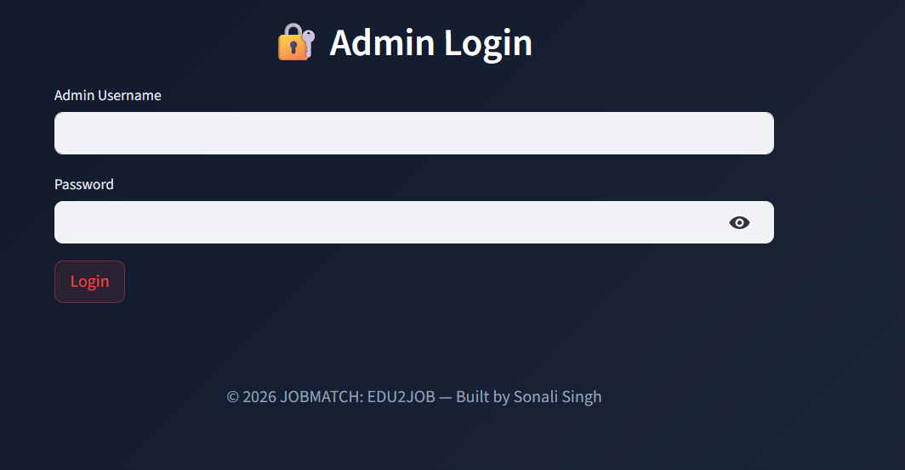
🛠 Admin Panel
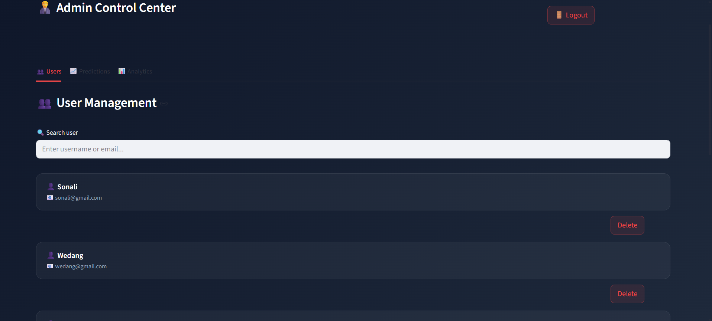
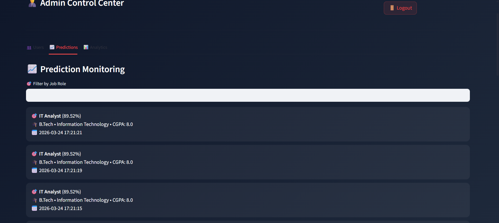
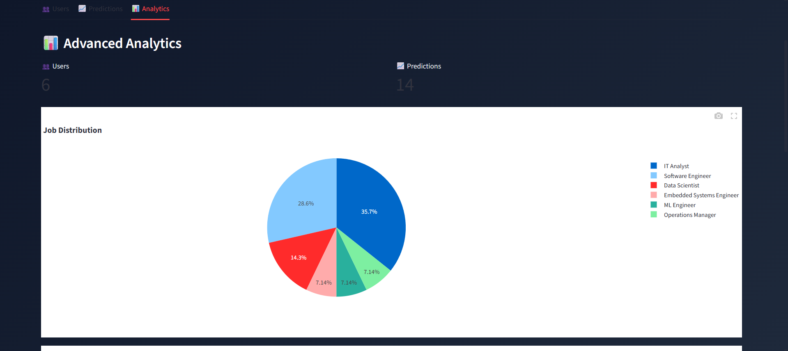
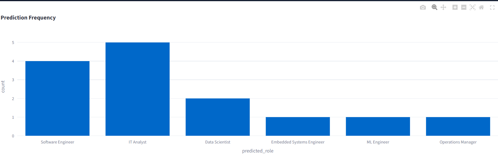
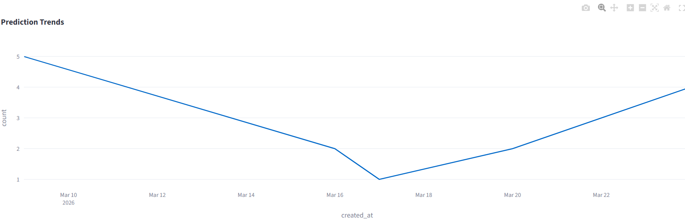
👩‍💻 Author
Sonali Singh
B.Tech CSE | AI/ML Enthusiast
📧 Email: sonali04037@gmail.com
🔗 LinkedIn: https://www.linkedin.com/in/sonali-singh-73644a248/⁠�
💻 GitHub: https://github.com/Sonu495⁠�

📌 Conclusion
JOBMATCH: EDU2JOB provides a smart, data-driven solution for career guidance by combining machine learning with an intuitive user interface. It enhances decision-making for students and provides scalable architecture for future improvements.